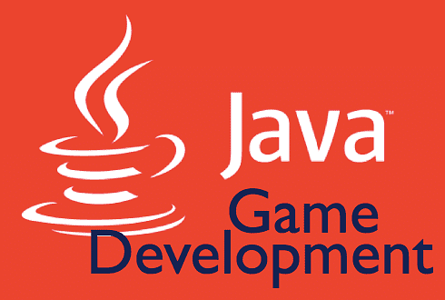

# Змейка
Описание: Игрок управляет змейкой, которая движется по игровому полю, собирая еду и увеличивая свою длину. Игра заканчивается, если змейка сталкивается с границей поля или с самой собой.
## Описание проекта
Данный проект представляет собой игру "Змейка" написанную с использованием библиотеки Swing
### Требования 

   - Игровое поле размером 20x20 клеток.
   - Управление змейкой с помощью стрелок на клавиатуре.
   - Генерация еды в случайных местах.
   - Отображение счета (количество съеденной еды).
   - Возможность перезапуска игры после окончания.
